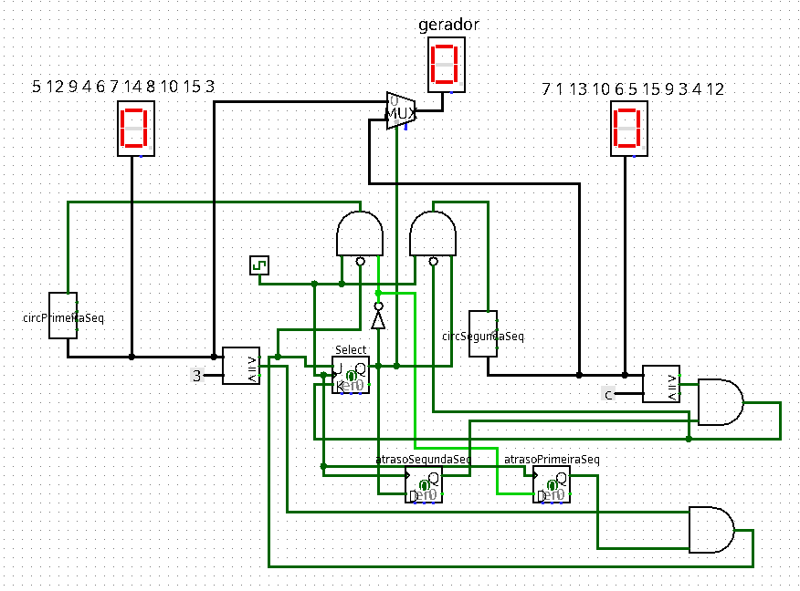

# Gerador de Sequências Numéricas — Logisim

O objetivo do projeto é projetar e implementar dois geradores de sequências numéricas independentes utilizando contadores síncronos com Flip-Flops, alternando automaticamente a execução de ambas as sequências em um display hexadecimal.

## Visão Geral

O projeto é dividido em dois subcircuitos principais interligados no circuito principal (main):

1. Primeira Sequência (circPrimeiraSeq): 5, 12, 9, 4, 6, 7, 14, 8, 10, 15, 3.
2. Segunda Sequência (circSegundaSeq): 7, 1, 13, 10, 6, 5, 15, 9, 3, 4, 12.
3. Main:
- Lógica de Alternância: utiliza flip-flops e comparadores, quando a primeira sequência atinge seu valor final (3), o pulso de clock passa a ser direcionado exclusivamente para a segunda sequência. Ao atingir o valor final da segunda sequência (12), o controle retorna para a primeira.
- Exibição: utiliza multiplexador e display hexadecimal de 7 segmentos.

## Como Executar o Projeto

1. Utilize o software Logisim ou acesse o site Logisim.app.
2. Clique em File > Open e selecione o arquivo gerador-sequencias.circ.
3. Para iniciar a simulação, ative o pulso de clock em Simulate > Ticks Enabled.
